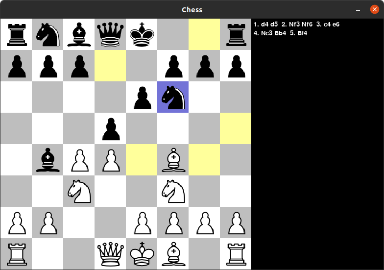

# Python Chess Engine

## Table of contents
* [General info](#general-info)
* [Engine Improvements TODO](#engine-improvements-todo)
* [UI TODO](#ui-todo)
* [Instructions](#instructions)
* [Further development ideas](#further-development-ideas)

## General info
I have been playing chess since primary school and one day I had an idea to implement chess in Python. Then, I came across a tutorial by Eddie Sharick, who made a whole 16 episodes series covering the topic.
This repository is a result of following his videos, sometimes coming up with some improvements on my own. Hereby, I highly
encourage you to visit his YouTube channel and check the whole series by yourself.

[Eddie's YouTube channel](https://www.youtube.com/channel/UCaEohRz5bPHywGBwmR18Qww)

[First episode of "Chess engine in Python"](https://www.youtube.com/playlist?list=PLBwF487qi8MGU81nDGaeNE1EnNEPYWKY_)

## Engine Improvements TODO
feel free to contribute :grinning:
- [ ] Cleaning up the code - right now it is really messy.
- [ ] Change move calculation to make it more efficient. Instead of recalculating all moves, start with moves from previous board and change based on last move made.
- [ ] Calculate both players moves given a position.
- [ ] Stalemate on 3 repeated moves or 50 moves without capture/pawn advancement.
- [ ] If move is a capture move, even at max depth, continue evaluating until no captures remain (not sure if this could help calculating the board score better).
- [ ] Using numpy arrays instead of 2d lists.

## UI TODO
- [ ] Menu to select player vs player/computer.
- [ ] Allow dragging pieces.
- [ ] Flip board options (display from black perspective).
- [ ] Change color of board/pieces - different piece skins.

## Instructions
1. Clone this repository 
2. Run `python3 -m pip install -r ./requirements.txt`
3. Run `python3 ChessMain.py`.
4. Enjoy the game!

#### Keys:
* Press `z` to undo a move.
* Press `r` to reset the game.

#### Notes: 
* For now, the game runs with PvP mode enabled.

## Further development ideas
1. Move ordering - look at checks, captures and threats first, prioritize castling/king safety, look at pawn moves last (this will improve alpha-beta pruning). Also start with moves that previously scored higher (will also improve pruning).
2. Hash board positions already visited to improve computation time for transpositions, so that after a move is made the engine doesn't have to recalculate all the moves.
3. Evaluating kings placement on the board (separate in middle game and in the late game).
4. Book of openings.
